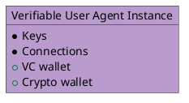
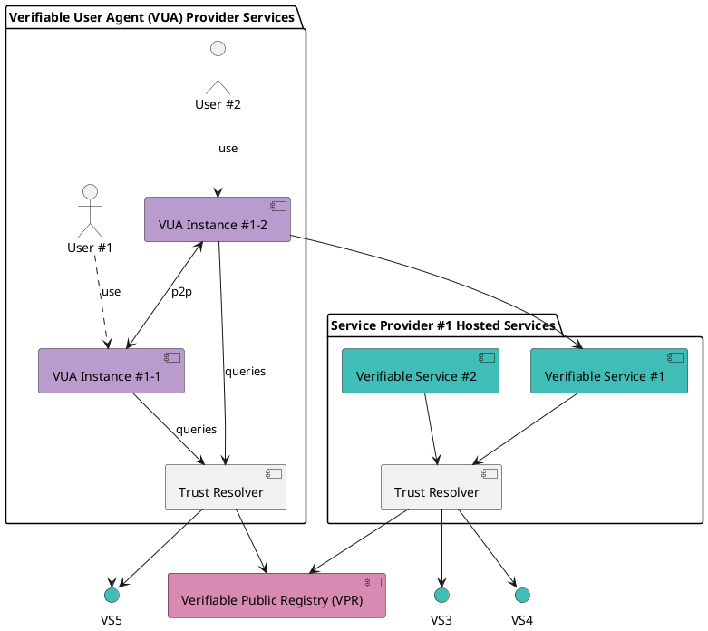

Verifiable User Agents (VUAs) are a new category of applications that aggregate and interact with decentralized Verifiable Services (VSs). Instead of relying on centralized APIs or walled-garden platforms, these apps query the Verana Trust Resolver, making any compatible Verifiable Service instantly visible and usable.

### What VUAs Can Be

VUAs open the door to a wide variety of decentralized applications:

- 🌐 Decentralized Social Networks: E.g., an X-like network built from decentralized Social Channels.
- 🤖 Chatbot & AI Assistant Browsers: Apps for discovering and talking with official chat services and personal AI assistants.
- 🎬 Decentralized Video Apps: Streaming apps that aggregate film catalogs published by creators.
- 🛒 E-commerce Aggregators: Apps that list all businesses using e-commerce Verifiable Services.
- …and many more innovations waiting to be built.

### Business Models for VUA Builders

VUA developers can also create their own ecosystem within Verana. This allows them to:

- Define their Ecosystem Governance Framework (EGF).
- Issue or sell credentials to Verifiable Service owners.
- Control how services appear within their VUA app. When a service owner attaches such a credential to their Verifiable Service’s, they automatically become discoverable inside the VUA.

### Why This Matters

Traditional apps depend on opaque algorithms and advertising-driven models. VUAs flip this model: visibility and ranking are based on verifiable credentials and ecosystem-defined governance, ensuring fairness, privacy, and transparency.

## Verifiable User Agent (VUA)

A verifiable user agent (VUA) is software, such as a browser, app, or wallet, designed to connect with verifiable services (VS) and other VUAs. When establishing connections, a VUA must verify the identity and trustworthiness of its peers and allow connections only to compliant VS or VUA peers.

As part of this process, the verifiable user agent (VUA) must perform trust resolution by:

- Verifying the verifiable credentials presented by peers;

- Querying verifiable public registries (VPRs) to confirm that the credentials were issued by recognized and authorized issuers.

This ensures that all connections are established on the basis of verifiable trust, rather than assumptions.

In addition, VUAs can query an index (the DID directory, managed by the VPR - see below) that catalogs all known verifiable services (VSs), to search VSs compatible with the VUA or VSs that present a certain type of credential. This enables:

- users to search for and discover relevant services: for example, within a social browser VUA, a user could search for a social channel VS by querying the index for an influencer’s name.

- VUA vendors to require VSs to present a certain type of credential (free or paid) for being listed in the VUA, of for having specific features in the VUA (premium, etc).

[Hologram Messaging](https://hologram.zone), a chatbot and AI agent browser, is the **first known verifiable user agent**.
