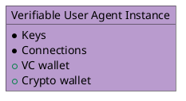
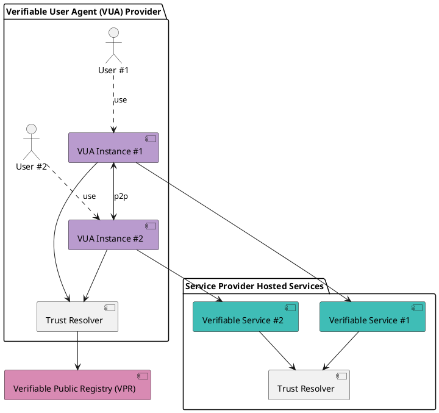

**Verifiable User Agents (VUAs)** are a new class of applications that **aggregate and interact with decentralized Verifiable Services (VSs)**.  
Instead of relying on centralized APIs or walled-garden platforms, these apps query the **Verana Trust Resolver**, making any compatible Verifiable Service instantly visible and usable.

---

## What VUAs Can Be

VUAs unlock a wide variety of decentralized apps, for example:

- 🌐 **Decentralized Social Networks** — e.g., an X-like network built from decentralized Social Channels.  
- 🤖 **Chatbot & AI Assistant Browsers** — apps for discovering and talking with official chat services and personal AI assistants.  
- 🎬 **Decentralized Video Apps** — streaming apps that aggregate film catalogs published by creators.  
- 🛒 **E-commerce Aggregators** — apps that list all businesses using e-commerce Verifiable Services.  
- 🏨 **Decentralized Hotel PMS Apps** — users can book hotels directly through verified PMS-powered services.  
- …and many more innovations waiting to be built.  

Because indexing is trust-based, inclusion is **automatic and verifiable**: no gatekeepers, no paywalls.

---

## Business Models for VUA Builders

VUA developers can also create their **own ecosystem** within Verana. This allows them to:

- Define their **Ecosystem Governance Framework (EGF)**.  
- Issue or sell **credentials** to Verifiable Service owners.  
- Control how services appear within their VUA app.  

When a service owner attaches such a credential to their Verifiable Service’s DID, they **automatically become discoverable** inside the VUA.

*Example:* In a “Blue Network” VUA, an influencer could get a free credential to appear in the app or purchase a premium credential to guarantee an ad-free experience for their followers.  

This creates sustainable, privacy-preserving business models while giving service owners full autonomy over visibility and monetization.

---

## How VUAs Work

A **Verifiable User Agent (VUA)** is software—such as a browser, wallet, or app—that connects to VSs and other VUAs. To establish connections, a VUA must:

- Verify the **credentials** presented by peers.  
- Query the **Verana Network** to confirm credentials were issued by recognized authorities.  

This ensures all connections are based on **verifiable trust**, not assumptions.

In addition, VUAs can query the **Verifiable Service Directory** (indexed by the Trust Resolver) to:  

- Let users search for services by credential attributes (e.g., find a social channel linked to an influencer’s name).  
- Enforce inclusion policies (e.g., only VSs with certain credentials can be listed or promoted).  

---

## Diagrams

---

## Why This Matters

Traditional apps rely on opaque algorithms and advertising-driven models.  
**VUAs flip this model**: visibility and ranking are based on **verifiable credentials and ecosystem-defined governance**, ensuring fairness, privacy, and transparency.  

The first known Verifiable User Agent is [**Hologram Messaging**](https://hologram.zone), a chatbot and AI agent browser.
