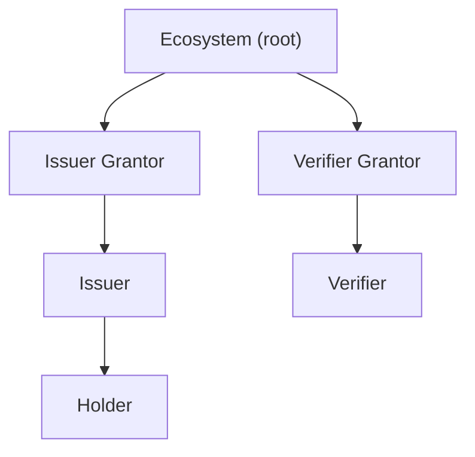
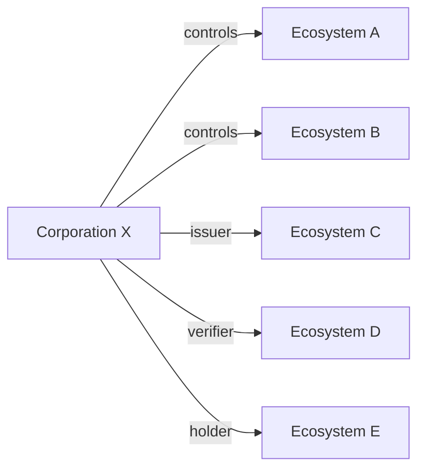
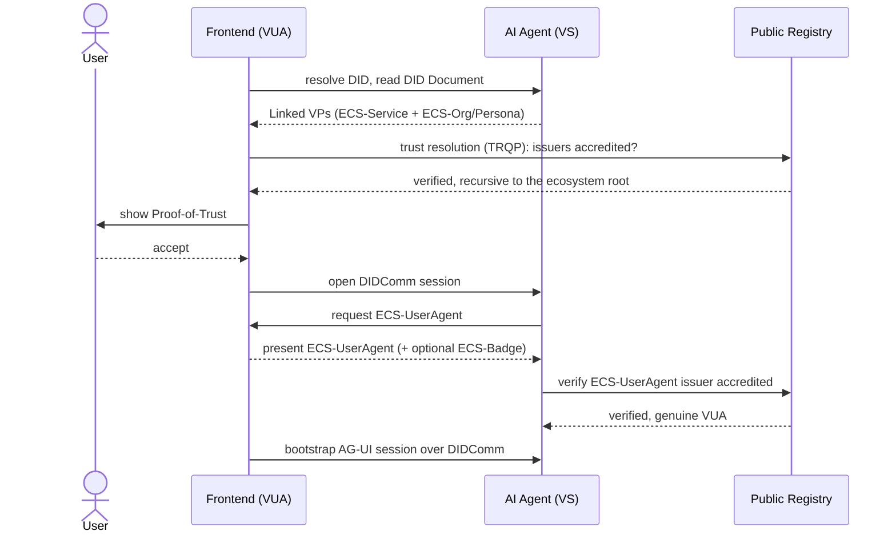
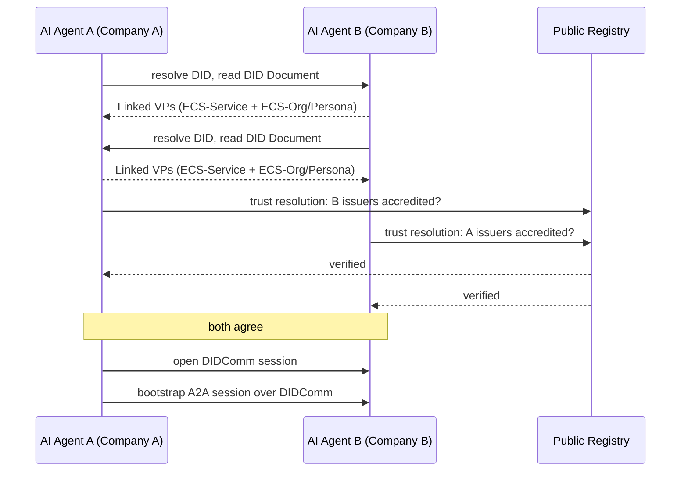
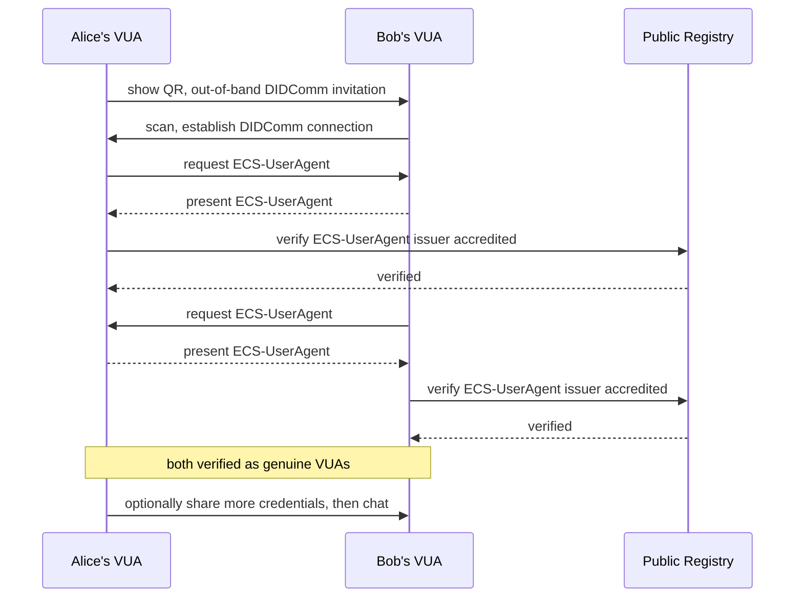
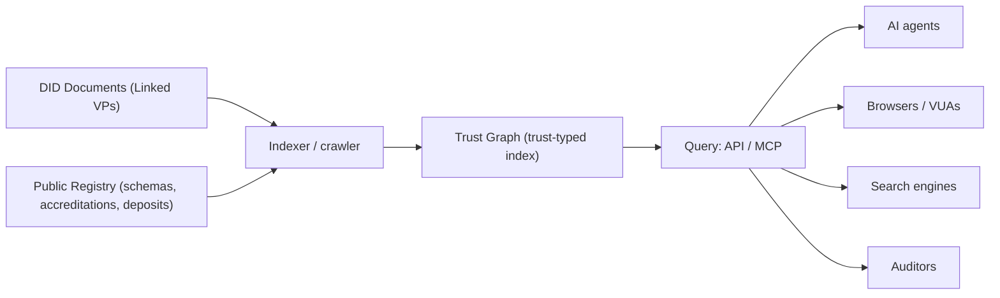

# How it works

**Verana, in three parts**

Sovereign ecosystems (Trust Ecosystems), verifiable identity (Verifiable Trust), and discovery (the Trust Graph), with the registry that anchors them underneath. Every deep detail links to the specs and docs.

---

## Sovereign ecosystems: Join or build an ecosystem

### What is an ecosystem?

Verana is public, permissionless infrastructure: anyone can create their own ecosystem, or join the ecosystems they want. An ecosystem is a governed list of recognized participants authorized to issue, verify, or hold certain credentials. It publishes a governance framework, defines its credential schemas, and sets who is accredited through a **participant tree**: the ecosystem is the root and delegates to grantors, who accredit issuers and verifiers, who in turn issue to holders. Permission modes range from fully open to fully governed.

**Participant tree**

**What an ecosystem holds**

- A governance framework (the EGF) and its versions.
- One or more credential schemas (the credentials it issues).
- An accreditation tree of grantors, issuers, verifiers, holders.
- A built-in business model (fees and trust deposits).

### Business models

Each participant in the tree can charge fees, paid using the network and distributed up the tree to the accrediting participants:

- **Onboarding and accreditation.** An applicant pays a validation fee to be accredited as an issuer, verifier, or grantor. Renewable each validity period.
- **Pay-per-issuance.** An issuer pays a fee each time it issues a credential of a schema.
- **Pay-per-verification.** A verifier pays a fee each time it verifies a credential, shared with the issuer and the rest of the tree.

Schemas can also be fully open, with no fees.

### Trust score: skin in the game, earned not bought

A fraction of every paid trust operation is committed to the participant's trust deposit as Trust Units (TU): a non-transferable, non-refundable, fiat-pegged measure of trust. The deposit balance is the participant's **trust score**, so it reflects cumulative real usage, not market timing or capital.

Misbehavior is met with **slashing**: a network or ecosystem authority destroys Trust Units, lowering the score, and while a slash is unrepaid the participant's permissions are non-trustable. Because trust cannot be transferred or sold, only earned, relying parties and the Trust Graph can rank and filter by trust score and slashing history to favor accountable parties.

### Corporations join, and build

A corporation registers itself in Verana (its own DID and governance framework), then relates to the registry in two complementary ways, and most do both: **join** any number of ecosystems as an accredited issuer, verifier, or holder, and **control** any number of its own. A corporation can own and join an unlimited number of ecosystems, in any combination.

### The ECS Ecosystem, the identity baseline

The ECS Ecosystem is the shared identity baseline of Verana. It publishes the Essential Credential Schemas (ECS), the small set of credentials that every other ecosystem relies on to identify and mutually verify the parties of an interaction. It is governed by the **Verana Council**, a neutral, non-profit Swiss association that governs and secures the live network, and the ECS Ecosystem. On top of this baseline, each Ecosystem defines its own domain credentials (govID, diploma, reusable KYC, machine certificate, and more).

The five ECS cover three roles: the owner or operator behind a service, the actor itself, and the user-agent software a person connects with.

| Credential | Role | What it identifies |
| --- | --- | --- |
| **ECS-Organization** | Owner / operator | Identifies a legal organization that operates one or more verifiable services. |
| **ECS-Persona** | Owner / operator | Identifies an individual, a human-controlled avatar, that operates one or more verifiable services. |
| **ECS-Service** | Actor | Identifies a service, an AI agent, a connected object, and more: the actor that acts on the network. The service's controller is the issuer of the credential. |
| **ECS-Badge** | Actor | Identifies a human actor. Held by a person and issued by a verifiable service, it carries the human's identity and attributes. The holder usually represents an employee of the organization that issued it. |
| **ECS-UserAgent** | User-agent software | Identifies the software a person operates (app, wallet, or browser). Its controller, the software product line, is the issuer of the credential. |

---

## Verifiable identity: Verify first, then connect

Verana inverts "connect first, verify later". A Verifiable Service is identified by a resolvable DID, not an opaque URL. Its DID Document exposes a DIDComm bootstrap endpoint and, optionally, MCP, A2A, AG-UI, website, or any other service it chooses to expose through its DID Document. Peers trust-resolve each other, recursively to the ecosystem root, and display a Proof-of-Trust before the first interaction. The same model covers three connection types.

### 1. A person connects to a service

*Verifiable User Agent to Verifiable Service.*

An AG-UI compatible frontend (a Verifiable User Agent) connects to an enterprise AI agent (a Verifiable Service). The frontend resolves the agent's DID, checks its ECS-Service and ECS-Org or ECS-Persona credentials and their issuers, and shows a Proof-of-Trust. After the user accepts, it opens a DIDComm session, presents an ECS-UserAgent credential (and optionally an ECS-Badge for the human), then the AG-UI session is bootstrapped over the DIDComm session.

### 2. A service connects to another service

*Verifiable Service to Verifiable Service.*

An AI agent from Company A connects to an AI agent from Company B (both Verifiable Services). Each verifies the credentials the other presents in its DID Document (ECS-Service plus ECS-Org or ECS-Persona, as Linked Verifiable Presentations). If both agree, a DIDComm session starts and an A2A session is bootstrapped over it.

### 3. Two people open a private connection

*Verifiable User Agent to Verifiable User Agent.*

Alice and Bob use a chat application (each a Verifiable User Agent) and want a private peer-to-peer DIDComm connection. Alice shows a QR code, an out-of-band DIDComm invitation, that Bob scans. Once connected, both agents present an ECS-UserAgent credential, and each verifies through the public registry that the credential's issuer is accredited, so each knows the other is a legitimate user agent. They can then optionally share more credentials over the channel.

---

## Discovery: Discover who you can trust

Because public credentials are published in DID Documents, the registry can be indexed into a trust-typed graph: find services and ecosystems by the credentials they hold, scope to an ecosystem, and rank by trust signals. A first-class surface for AI-agent discovery. Every result carries verifiable provenance, so you can check it before you act on it.

### A few example queries

Each result carries a verified seal, a trust score (0 to 5), a trust deposit in Trust Units (TU), a `did:webvh` DID, and the protocols it exposes.

**Query: "Show me all the Verifiable Services of Company B"**

| Result | Kind | Org | Verified | Trust score | Deposit | Protocols | DID |
| --- | --- | --- | --- | --- | --- | --- | --- |
| Customer Support Agent | AI agent | 🇩🇪 Company B | ✅ | ★ 4.5 | 18,200 TU | MCP, A2A, Website | `did:webvh:QmRhJB7x2...8Kpr:support.vs.company-b.example` |
| company-b.example | Website | 🇩🇪 Company B | ✅ | ★ 4 | 9,600 TU | Website | `did:webvh:Qm9fK2aZ...3Lmn:www.vs.company-b.example` |
| Employee Assistant | AI agent | 🇩🇪 Company B | ✅ | ★ 3.5 | 4,100 TU | AG-UI | `did:webvh:QmT4pL8wq...QrZ2:hr.vs.company-b.example` |

**Query: "Ecommerce site selling baby shoes made in Colombia, delivering to Bogotá"**

| Result | Kind | Org | Verified | Trust score | Deposit | Protocols | Tags | DID |
| --- | --- | --- | --- | --- | --- | --- | --- | --- |
| zapaticos.example | Ecommerce | 🇨🇴 Zapaticos SAS | ✅ | ★ 5 | 26,000 TU | Website, A2A | Made in Colombia; Delivers: Bogotá | `did:webvh:QmZ7nB4d...kP9x:shop.vs.zapaticos.example` |
| andesbaby.example | Ecommerce | 🇨🇴 Andes Baby SA | ✅ | ★ 4 | 11,300 TU | Website | Made in Colombia; Delivers: Bogotá; KYB verified | `did:webvh:QmA3vC9h...mN4t:store.vs.andesbaby.example` |

**Query: "Ecosystems that issue an ISO 42001 credential for France"**

| Result | Kind | Org | Verified | Trust score | Deposit | Tags | DID |
| --- | --- | --- | --- | --- | --- | --- | --- |
| EU AI Trust Ecosystem | Ecosystem | 🇪🇺 EU AI Trust Foundation | ✅ | ★ 4.5 | 120,000 TU | 3 accredited issuers; 35 accredited verifiers | `did:webvh:QmEu42aT...001a:ecosystem.eu-ai-trust.example` |
| Global AI Assurance | Ecosystem | 🇺🇸 Global AI Assurance Inc | ✅ | ★ 5 | 300,000 TU | 7 accredited issuers; 157 accredited verifiers | `did:webvh:QmUs42tR...90us:ecosystem.global-ai-assurance.example` |

---

## Learn more

- Verifiable Trust spec
- VPR spec
- See the software

> Source: this document is a Markdown export of the site's `/how-it-works` page ([app/how-it-works/page.tsx](app/how-it-works/page.tsx)). The example query results are illustrative.
