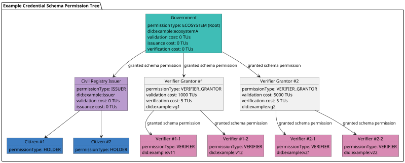

Verana provides governments with full **open source software and infrastructure** to issue **privacy-preserving, verifiable, decentralized Digital IDs** that empower citizens while maintaining national sovereignty over identity systems.

## Create the Digital Identity Ecosystem

Governments begin by creating their **Ecosystem Trust Registry** in Verana.

### Ecosystem Governance Framework

- Establish an **Ecosystem Governance Framework (EGF)** that sets schemas, rules for issuance, verification, and authorization of participants.

#### Json Schema

- Define a **Citizen ID Credential Schema**. Example:

```json

{
  "$id": "vpr:verana:vna-testnet-1/v1/cs/js/VPR_CREDENTIAL_SCHEMA_ID",
  "$schema": "https://json-schema.org/draft/2020-12/schema",
  "title": "PersonCredential",
  "description": "PersonCredential using JsonSchema",
  "type": "object",
  "properties": {
    "credentialSubject": {
      "type": "object",
      "properties": {
        "id": {
          "type": "string",
          "format": "uri"
        },
        "firstName": {
          "type": "string",
          "minLength": 0,
          "maxLength": 256
        },
        "lastName": {
          "type": "string",
          "minLength": 1,
          "maxLength": 256
        },
        "photo": {
          "type": "string",
          "contentEncoding": "base64",
          "contentMediaType": "image/png"
        },
        "birthDate": {
          "type": "string",
          "format": "date"
        },
        "countryOfResidence": {
          "type": "string",
          "minLength": 2,
          "maxLength": 2
        }
      },
      "required": [
        "id",
        "lastName",
        "birthDate",
        "photo",
        "countryOfResidence"
      ]
    }
  }
}

```

#### Define Ecosystem Participation Rules

Example of participation rules. TUs means Trust Units, it can be any amount.



Comments:

- Government selects a single issuer: the Civil Registry Issuer. Citizens will obtain their Citizen ID Verifiable Credential from Civil Registry and will not be charged for that (Civil Registry Issuer validation cost: 0 TUs).
- When the Civil Registry issues a credential to a Citizen, it will not pay anything to government (Government issuance cost: 0 TUs)

Now, for the onboarding of verifiers, as their will be a lot of verifiers (participants that request presentation of a Citizen ID Verifiable Credential), it could become really time consuming and fastidious for the Government to select Verifier on their own.

It's better to rely on Grantors for that. Here in this example, the Government delegates to 2 Organizations the role of Verifier Grantor. Verifier Grantors cannot issue or verify credential, but their role is to select Verifiers. They are enabled by Government, that decide, when they enable them, business models that they will apply to Verifiers.

Example:

- **Verifier Grantor #1** has set a validation cost of 1000 TUs. That mean that any **Validator candidate** will have to pay 1000 TUs to be enabled as a **Verifier**. Additionally, they will need to renew their permission each determined period, usually 365 days.
- Furthermore, the **Verifier Grantor #1** set the verification cost to 5 TUs. That mean each time a **Verifier** they onboarded request the presentation of a Citizen ID Verifiable Credential to a Citizen, they need to pay 5 TUs to **Verifier Grantor #1**.

This registry ensures that only authorized issuers and verifiers can participate in the Verifiable Digital ID system, and establish business models to monetize the solution.

## Connect to the Verana Testnet

Follow instructions [here](https://verana.io/page/developers/testnet/).

## Create the on-chain Resources in Verana

Connect to Verana front-end.

### Trust Registry

Available through: Frontend, CLI

Create a Trust Registry.

- DID: you need to put a DID that is under your control. If you don't have a DID yet, you can put any value at the moment and update it later. Make sure the format is `did:*:*`, example: `did:example:trust-registry`. Refer to [DID-core](https://www.w3.org/TR/did-1.0/) for more information about DIDs.
- Aka: put the URL of your Organization.
- Primary Governance Framework Language: choose a language for your governance framework.
- Governance Framework Primary Document URL: if you're testing, put any URL, that will be fine. Else, put a link with the PDF of your governance framework, in the language you selected.

Confirm and create the transaction.

### Credential Schema

Available through: Frontend, CLI

You need to choose a strategy for the credential schema. [Read the docs here](https://docs.verana.io/docs/next/learn/verifiable-public-registry/onboarding-participants)

Usually, for Governments Digital ID, the common option is:

- Issuer Permission Management Mode: TRUST_REGISTRY (the government issues itself the credentials, so no need to have a grantor)
- Verifier Permission Management Mode: GRANTOR, so that the government can delegate the selection of Verifiers to third party companies, for best efficiency.
- Validity Periods should be set to 365 days, so that permissions must be renewed each year.
- Credential Schema: set the above example (**Citizen ID Credential Schema**) after modifying it if you want.

Confirm and create the transaction.

### Onboarding of participants

Available through: CLI only (at the moment, frontend scheduled for 10/2025)

### Root Permission (Government)

- The Trust Registry owner (the Ecosystem controller) creates the Root Permission (for the **Government**): [see documentation](https://docs.verana.io/docs/next/use/ecosystems/permissions/create-a-root-permission)

### Civil Registry Issuer

- Then, the Civil Registry Issuer will obtain an issuer permission from the **Government**
  1. Civil Registry Issuer [launches the validation process](https://docs.verana.io/docs/next/use/ecosystems/permissions/run-a-validation-process-to-obtain-a-permission)
  2. Government [validate the process](https://docs.verana.io/docs/next/use/ecosystems/permissions/set-permission-to-validated)

### Verifier Grantor #1

- Then, the **Verifier Grantor #1** will apply and obtain an issuer permission from the **Government**
  1. **Verifier Grantor #1** [launches the validation process](https://docs.verana.io/docs/next/use/ecosystems/permissions/run-a-validation-process-to-obtain-a-permission)
  2. **Government** [validate the process](https://docs.verana.io/docs/next/use/ecosystems/permissions/set-permission-to-validated)

same process is repeated by Verifier Grantor #2

### Verifier #1-1

- Then, the **Verifier #1-1** will apply and obtain an issuer permission from the **Verifier Grantor #1**
  1. **Verifier #1-1** [launches the validation process](https://docs.verana.io/docs/next/use/ecosystems/permissions/run-a-validation-process-to-obtain-a-permission)
  2. **Verifier Grantor #1** [validate the process](https://docs.verana.io/docs/next/use/ecosystems/permissions/set-permission-to-validated)

same process is repeated by any new candidate that would like to obtain a Verifier permission from **Verifier Grantor #1**.

## Deploying the GovID issuer

We will use the open source [GovID github repository](https://github.com/2060-io/hologram-gov-id-issuer-vs).

You can either:

- deploy the existing GovID container
- fork the repo a do any change you need, and deploy your own GovID verifiable service.

Instruction for using the GovID repository are available [here](https://github.com/2060-io/hologram-gov-id-issuer-vs/blob/main/README.md)

## Citizen Onboarding into the Registry

For the next steps, we consider user is already onboarded in the civil registry and already owns a NFC ID Card or passport. At public offices (e.g., civil registry):

1. **Onboarding Verifiable Service** captures biometric data and validates documents.
2. Citizen data is recorded in the **central registry database**.
3. Citizen receives an **NFC-enabled ID card** containing personal and biometric information.

This ensures **official enrollment** into the state identity system

## Download Hologram Messaging for running the Demo

- Go to [Hologram Messaging website](https://hologram.zone) and download the latest version of Hologram.

> Note: Hologram is based on [credo-ts](https://credo.js.org/), a typescript sdk that you can embed in your own App and clone Hologram features.

## Issuing the Citizen ID Verifiable Credential

- go to the [GovID service](https://dm.gov-id-issuer.demos.2060.io/invitation) and connect with Hologram Messaging
- follow the instructions to obtain your **Citizen ID Verifiable Credential**.

### Example Enrollment Flow

1. The citizen captures a photo of their **physical ID card**. The app reads the **MRZ** to retrieve the key required for NFC access.  
2. The citizen enters the **PIN code of the card** to authorize the process.  
3. The citizen taps the ID card on the handset, enabling an **NFC read** of the document to extract personal and biometric information.  
4. The app performs a **live face match** against the extracted ID photo to confirm that the handset user is the legitimate cardholder.  
5. If all checks succeed, a **Citizen ID Verifiable Credential** is securely issued to the citizen’s digital wallet.  

👉 Any previously issued credential is **automatically revoked**, guaranteeing that only **one valid credential** exists per citizen at any time.  

## Deploying a Verifier service

- we will use the [generic-verifier-vs](https://github.com/2060-io/hologram-generic-verifier-vs) open source github repository.

You can either:

- deploy the existing Generic Verifier container
- fork the repo a do any change you need, and deploy your own Generic Verifier verifiable service.

Instruction for using the GovID repository are available [here](https://github.com/2060-io/hologram-generic-verifier-vs/blob/main/README.md).

To run the demo:

- open your browser and [point it to the verifier link](https://gov-id-verifier.demos.2060.io/en)
- scan the QR with Hologram and present your credential

## Configuring the Off-chain Services

- We managed to create all the **on-chain** data of the **Digital Identity Ecosystem**, as specified in the ecosystem governance framework [EGF].

- we managed to run the standalone demos

We can start to work on the **off-chain** setup to put all together.

### Off-chain configuration of the Trust Registry

- 1. deploy a [vs-agent](https://github.com/2060-io/vs-agent) container, with the same DID you configured on-chain. (you can update the DID on-chain if needed)
- 2. add to your DID document a reference to the trust registry you created above on-chain.
- 3. for the credential schema you created on-chain, self issue a Json Schema Credential, and add it to your DID Document.

### Off-chain configuration of Verifier #1-1

Verifier #1-1 must execute the same process.

- 1. deploy a [vs-agent](https://github.com/2060-io/vs-agent) container, with the same DID you configured on-chain in your permission. (For security reasons, you cannot update the DID on-chain, if you want to use a different DID, you must request a new permission)
- 2. In the DID Document of the trust registry, get the Json Schema Credential of the **Citizen ID Verifiable Credential**. Now you can issue verifiable credentials based on this Json Schema Credential.
- 3. Credential you issue based on this Json Schema Credential will be verifiable and resolvable.

## Selective Disclosure

Selective disclosure is supported. When requesting credential presentation, verifier specifies which attributes they want to request. User will see the requested attributes in the request and decide if they accept or not.

- Citizens to **prove attributes without revealing full data** (e.g., “over 18” without disclosing date of birth).
- Minimal disclosure principles, reducing risks of data misuse.
