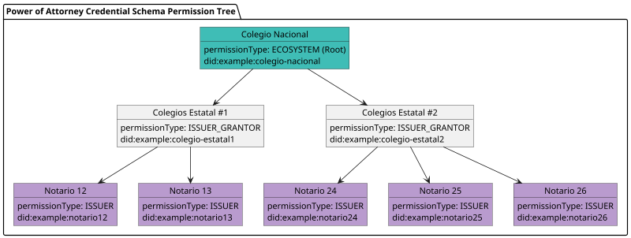

## A Manual, Inefficient Process

In Mexico, granting and using a **Power of Attorney** is a **paper-based, fragmented, and costly process**.

### Issuing a Power of Attorney

- The grantor visits a notary and proves they are the legal representative of a company.
- The notary drafts the power, signs it together with the grantor, and keeps a physical copy in their files.
- The signed document is physically delivered to both the grantor and the grantee.
- There is **no central database** of powers of attorney in Mexico.

> uxpilot ai: add an illustration here

### Revoking a Power of Attorney

- The grantor or grantee can go to **any notary office** (not necessarily the one that issued it).
- If they don’t have a copy, the new notary must contact the original notary to obtain the document and proceed with revocation.

### Using a Power of Attorney

Example, at the bank:

- The grantee presents the **physical copy** of the power.
- The bank must call the notary who issued it to confirm authenticity.
- The bank should also **contact all notaries in Mexico** to ensure the power has not been revoked by another office.
- Banks and other verifiers often repeat this process periodically, “just in case” a power was revoked after issuance.

This system creates **unnecessary friction and cost** for notaries, grantees, and especially verifiers like banks, who face a repetitive and burdensome verification process.

> uxpilot ai: add an illustration here

## The Solution: A National Trust Ecosystem for Notaries

In Mexico, the notary system is structured as follows:

- **Colegio Nacional de Notarios** – the highest-level body.
- **Colegios Estatales** – state-level associations.
- **Notarios** – individual notary offices.

### Establishing a Digital Ecosystem

The **Colegio Nacional** creates a **Notarial Trust Ecosystem** on Verana to digitize and streamline the power of attorney process.  

1. **Publishes an Ecosystem Governance Framework (EGF):**

- Defines the rules for issuance, verification, revocation, and compliance.
- Establishes the **Power of Attorney Credential Schema**.

- Outlines procedures for onboarding participants:
  - the **Colegio Nacional** select **Colegios Estatales**.
  - **Colegios Estatales** are in charge of selecting **Notaries**
  - Notaries (Issuers): they issue the PoAs.
  - Verifiers, such as Banks, telcos, and other institutions, are granted self-onboarding.

2. **Implementation Diagram**

Based on the defined EGF, here is the corresponding **Power of Attorney Credential Schema** permission tree to implement:

3. **Creates a Trust Registry in Verana**

- Implements the rules and schemas defined in the EGF.
- Maintains the list of authorized issuers, verifiers, and registry grantors.
- Enforces revocation and validity checks across the ecosystem.

### Issuing a Power of Attorney - with Verifiable Credential

When a notary issues a new power of attorney:

- The notary drafts and signs the physical document as usual.
- The notary provides a **digital copy** to both the grantor and grantee.
- The notary issues a **Power of Attorney Credential** to both parties, containing:
  - Company name
  - Grantor name
  - Grantee name
  - Date and validity period
  - ...
  - A **hash of the digital copy** to guarantee authenticity.

### Revoking a Power of Attorney - with Verifiable Credential

- The grantor or grantee presents the credential at any notary office.
- If the credential was issued by another notary, the new notary can either:
  - Call the issuing notary to request revocation, or
  - Use the **ecosystem’s web service** to revoke the credential directly.
- Once revoked, the credential (and thus the PoA) becomes invalid across the entire ecosystem.

### Using a Power of Attorney - with Verifiable Credential

When the grantee presents the power to a verifier (e.g., a bank):

- The grantee provides both the **digital copy of the power of attorney** and their **verifiable credential**.
- The bank verifies authenticity of the verifiable credential and the document instantly.
- If the credential is active (not revoked), the power is valid: no further manual checks are needed.
- Banks and other verifiers can **periodically check credential revocation status automatically**, eliminating repetitive phone calls to notaries.

> uxpilot ai: add an illustration here

### Privacy Preserving Business models

Economic models can be activated so that those verifying powers of attorney (the verifiers, including banks, telecom providers...) make a small micropayment for each verification. This way, all participants in the ecosystem receive their corresponding commission.

## Conclusion: Saving Time, Reducing Costs

By digitizing the power of attorney process:

- **Banks and businesses** save significant time and money by eliminating manual verification with hundreds of notaries.
- **Grantors and grantees** gain confidence that their powers are instantly verifiable and securely revocable.
- **Notaries** maintain their traditional role while becoming part of a modern, national trust ecosystem.
- **The Colegio Nacional** reinforces its authority and provides a digital infrastructure that benefits all participants.

Verana transforms the **power of attorney** from a costly, paper-based process into a **verifiable, efficient, and fraud-resistant digital credential system**.
