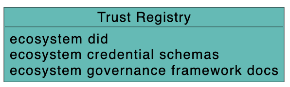
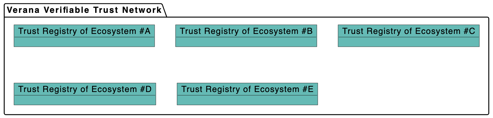
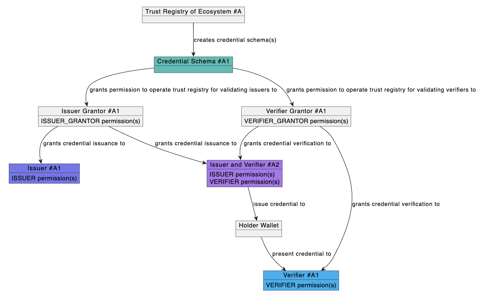

# Learn the Verana concepts

## What is an Ecosystem?

An Ecosystem is a **community of actors** (organizations, issuers, verifiers, holders, governance bodies) that operate according to **shared governance rules**, the Ecosystem Governance Framework (EGF) to enable **trusted digital interactions** within a specific domain.

### Key Components of an Ecosystem

✅ **Ecosystem Governance Framework**  
Defines how trust is established and maintained within the ecosystem (roles, policies, compliance rules, technical standards).

✅ **Technical Stack**

Based on the [ToIP layered architecture](https://trustoverip.org/toip-model/):

- DIDs
- Credential Schemas
- Verifiable Credentials
- Credential exchange protocols
- Trust registries

✅ **Actors** (participants):

- Issuers of verifiable credentials  
- Holders  
- Verifiers (relying parties)  
- Governance authorities  
- Trust registry operators  

✅ **Domain focus**  

Ecosystems typically form around a **specific domain** or use case:

- Healthcare  
- Financial services  
- Travel & mobility  
- Government eID  
- Supply chain  
- Education  
- IoT, etc.

### How ecosystems use Verana for their trust registries

Ecosystems use Verana for managing and governing their trust registries:

- create trust registries

- manage authorized participants
- define credential schemas
- for each credential schema, who can issue, verify, operate the trust registry

> *Illustration ideas*:
>
> Here we should have a single illustration for explaining the concept.

## How about the Business Models?

There are two kinds of business models in Verana.

## Trust Deposit and Reputation

