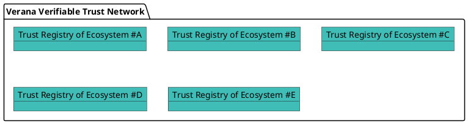
```plantuml

@startuml
scale max 800 width
 
package "Verana Verifiable Trust Network" as vpr {

    object "Trust Registry of Ecosystem #A" as esa #3fbdb6 {
    }

    object "Trust Registry of Ecosystem #B" as esb #3fbdb6 {

    }

    object "Trust Registry of Ecosystem #C" as esc #3fbdb6 {

    }

    object "Trust Registry of Ecosystem #D" as esd #3fbdb6 {

    }
    object "Trust Registry of Ecosystem #E" as ese #3fbdb6 {

    }
    
   
}


@enduml

```

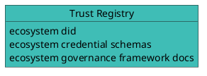
```plantuml

@startuml
scale max 800 width
 
object "Trust Registry" as tra #3fbdb6 {
    ecosystem did
    ecosystem credential schemas
    ecosystem governance framework docs
}


@enduml

```

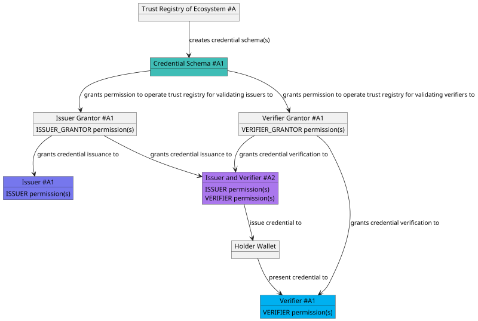
```plantuml

@startuml
scale max 800 width

object "Trust Registry of Ecosystem #A" as tra

    object "Credential Schema #A1" as csa1 #3fbdb6

    object "Issuer Grantor #A1" as iga1 {
        ISSUER_GRANTOR permission(s)
    }
    object "Issuer #A1" as ia1 #7677ed {
        ISSUER permission(s)
    }
    object "Issuer and Verifier #A2" as iva2 #AA77ed {
        ISSUER permission(s)
        VERIFIER permission(s)
    }
    object "Verifier #A1" as va1 #00b0f0 {
        VERIFIER permission(s)
    }
    object "Verifier Grantor #A1" as vga1 {
        VERIFIER_GRANTOR permission(s)
    }
    object "Holder Wallet" as au


tra --> csa1 : creates credential schema(s)
csa1 --> iga1 : grants permission to operate trust registry for validating issuers to
csa1 --> vga1 : grants permission to operate trust registry for validating verifiers to
iga1 --> iva2 : grants credential issuance to
iga1 --> ia1 : grants credential issuance to
vga1 --> va1 : grants credential verification to
vga1 --> iva2 : grants credential verification to
iva2 --> au : issue credential to
au --> va1 : present credential to


@enduml

```

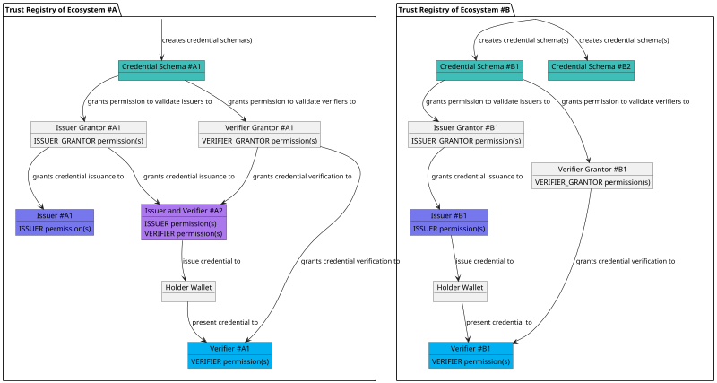
```plantuml

@startuml
scale max 800 width

package "Trust Registry of Ecosystem #A" as tra {
    object "Credential Schema #A1" as csa1 #3fbdb6

    object "Issuer Grantor #A1" as iga1 {
        ISSUER_GRANTOR permission(s)
    }
    object "Issuer #A1" as ia1 #7677ed {
        ISSUER permission(s)
    }
    object "Issuer and Verifier #A2" as iva2 #AA77ed {
        ISSUER permission(s)
        VERIFIER permission(s)
    }
    object "Verifier #A1" as va1 #00b0f0 {
        VERIFIER permission(s)
    }
    object "Verifier Grantor #A1" as vga1 {
        VERIFIER_GRANTOR permission(s)
    }
    object "Holder Wallet" as au
}

package "Trust Registry of Ecosystem #B" as trb {
    object "Credential Schema #B1" as csb1 #3fbdb6
    object "Credential Schema #B2" as csb2 #3fbdb6

    object "Issuer Grantor #B1" as igb1 {
        ISSUER_GRANTOR permission(s)
    }
    object "Issuer #B1" as ib1 #7677ed {
        ISSUER permission(s)
    }
    
    object "Verifier #B1" as vb1 #00b0f0 {
        VERIFIER permission(s)
    }
    object "Verifier Grantor #B1" as vgb1 {
        VERIFIER_GRANTOR permission(s)
    }
    object "Holder Wallet" as bu
}


tra --> csa1 : creates credential schema(s)
csa1 --> iga1 : grants permission to validate issuers to
csa1 --> vga1 : grants permission to validate verifiers to
iga1 --> iva2 : grants credential issuance to
iga1 --> ia1 : grants credential issuance to
vga1 --> va1 : grants credential verification to
vga1 --> iva2 : grants credential verification to
iva2 --> au : issue credential to
au --> va1 : present credential to


trb --> csb1 : creates credential schema(s)
trb --> csb2 : creates credential schema(s)

csb1 --> igb1 : grants permission to validate issuers to
csb1 --> vgb1 : grants permission to validate verifiers to
igb1 --> ib1 : grants credential issuance to
vgb1 --> vb1 : grants credential verification to
ib1 --> bu : issue credential to
bu --> vb1 : present credential to
@enduml

```

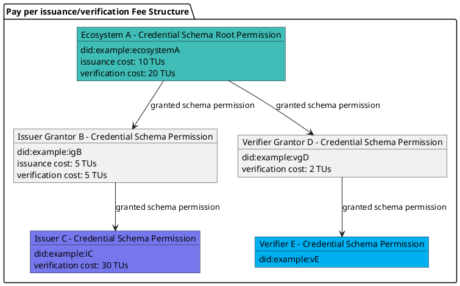
```plantuml

@startuml
scale max 800 width
 
package "Pay per issuance/verification Fee Structure" as cs {

    object "Ecosystem A - Credential Schema Root Permission" as tr #3fbdb6 {
        did:example:ecosystemA
        issuance cost: 10 TUs
        verification cost: 20 TUs
    }
    object "Issuer Grantor B - Credential Schema Permission" as ig {
        did:example:igB
        issuance cost: 5 TUs
        verification cost: 5 TUs
    }
    object "Issuer C - Credential Schema Permission" as issuer #7677ed  {
        did:example:iC
        verification cost: 30 TUs
    }
    object "Verifier Grantor D - Credential Schema Permission" as vg {
        did:example:vgD
        verification cost: 2 TUs
    }
    object "Verifier E - Credential Schema Permission" as verifier #00b0f0 {
        did:example:vE
    }
}


tr --> ig : granted schema permission
ig --> issuer : granted schema permission

tr --> vg : granted schema permission
vg --> verifier : granted schema permission

@enduml

```

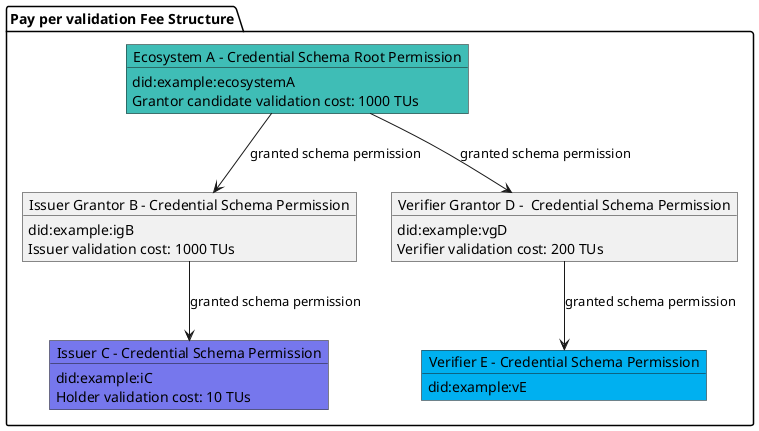
```plantuml

@startuml
scale max 800 width
 
package "Pay per validation Fee Structure" as cs {

    object "Ecosystem A - Credential Schema Root Permission" as tr #3fbdb6 {
        did:example:ecosystemA
        Grantor candidate validation cost: 1000 TUs
    }
    object "Issuer Grantor B - Credential Schema Permission" as ig {
        did:example:igB
        Issuer validation cost: 1000 TUs
    }
    object "Issuer C - Credential Schema Permission" as issuer #7677ed  {
        did:example:iC
        Holder validation cost: 10 TUs
    }
    object "Verifier Grantor D -  Credential Schema Permission" as vg {
        did:example:vgD
        Verifier validation cost: 200 TUs
    }
    object "Verifier E - Credential Schema Permission" as verifier #00b0f0 {
        did:example:vE
    }
}


tr --> ig : granted schema permission
ig --> issuer : granted schema permission

tr --> vg : granted schema permission
vg --> verifier : granted schema permission

@enduml

```

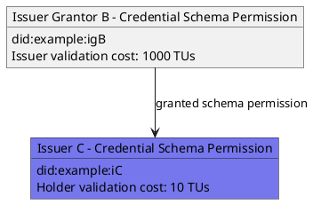
```plantuml

@startuml
scale max 800 width
 
    object "Issuer Grantor B - Credential Schema Permission" as ig {
        did:example:igB
        Issuer validation cost: 1000 TUs
    }
    object "Issuer C - Credential Schema Permission" as issuer #7677ed  {
        did:example:iC
        Holder validation cost: 10 TUs
    }


ig --> issuer : granted schema permission


@enduml

```

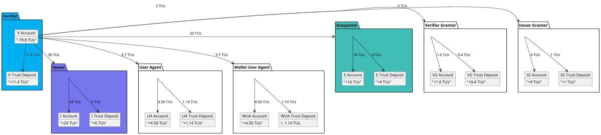
```plantuml

@startuml
scale max 1200 width
 

package "Ecosystem" as tr #3fbdb6 {
    object "E Account" as tra {
         "+16 TUs"
    }
    object "E Trust Deposit" as trtd {
         "+4 TUs"
    }
}

package "Issuer Grantor" as ig {
    object "IG Account" as iga {
        "+4 TUs"
    }
    object "IG Trust Deposit" as igtd {
        "+1 TUs"
    }
}
package "Issuer" as issuer #7677ed {
    object "I Account" as issuera {
         "+24 TUs"
    }
    object "I Trust Deposit" as issuertd {
         "+6 TUs"
    }

}
package "Verifier Grantor" as vg {
    object "VG Account" as vga {
        "+1.6 TUs"
    }
    object "VG Trust Deposit" as vgtd {
        "+0.4 TUs"
    }

}
package "Verifier" as verifier #00b0f0 {
    object "V Account" as verifiera {
        "-79.8 TUs"
    }
    object "V Trust Deposit" as verifiertd {
        "+11.4 TUs"
    }

}
package "User Agent" as ua {
    object "UA Account" as uaa {
         "+4.56 TUs"
    }
    object "UA Trust Deposit" as uatd {
        "+1.14 TUs"
    }

}
package "Wallet User Agent" as wua {
    object "WUA Account" as wuaa {
         "+4.56 TUs"
    }
    object "WUA Trust Deposit" as wuatd {
        +1.14 TUs
    }

}


verifiera -r-> tr: 20 TUs
tr --> tra: 16 TUs
tr --> trtd: 4 TUs

verifiera -r-> vg: 2 TUs
vg --> vga: 1.6 TUs
vg --> vgtd: 0.4 TUs

verifiera -r-> ig: 5 TUs
ig --> iga: 4 TUs
ig --> igtd: 1 TUs

verifiera -d-> issuer: 30 TUs
issuer --> issuera: 24 TUs
issuer --> issuertd: 6 TUs

verifiera -d-> ua: 5.7 TUs
ua --> uaa: 4.56 TUs
ua --> uatd: 1.14 TUs

verifiera -d-> wua: 5.7 TUs
wua --> wuaa: 4.56 TUs
wua --> wuatd: 1.14 TUs

verifiera --> verifiertd: 11.4 TUs

@enduml

```

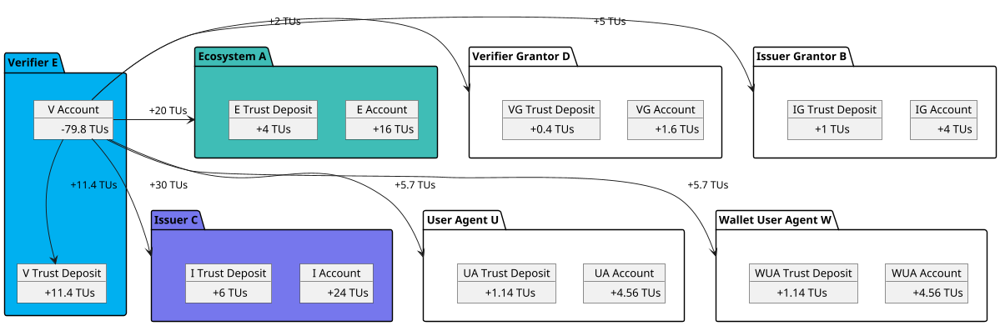
```plantuml

@startuml
scale max 1200 width
 

package "Ecosystem A" as tr #3fbdb6 {
    object "E Account" as tra {
         \t+16 TUs
    }
    object "E Trust Deposit" as trtd {
         \t+4 TUs
    }
}

package "Issuer Grantor B" as ig {
    object "IG Account" as iga {
        \t+4 TUs
    }
    object "IG Trust Deposit" as igtd {
        \t+1 TUs
    }
}
package "Issuer C" as issuer #7677ed {
    object "I Account" as issuera {
         \t+24 TUs
    }
    object "I Trust Deposit" as issuertd {
         \t+6 TUs
    }

}
package "Verifier Grantor D" as vg {
    object "VG Account" as vga {
        \t+1.6 TUs
    }
    object "VG Trust Deposit" as vgtd {
        \t+0.4 TUs
    }

}
package "Verifier E" as verifier #00b0f0 {
    object "V Account" as verifiera {
        \t-79.8 TUs
    }
    object "V Trust Deposit" as verifiertd {
        \t+11.4 TUs
    }

}
package "User Agent U" as ua {
    object "UA Account" as uaa {
         \t+4.56 TUs
    }
    object "UA Trust Deposit" as uatd {
        \t+1.14 TUs
    }

}
package "Wallet User Agent W" as wua {
    object "WUA Account" as wuaa {
         \t+4.56 TUs
    }
    object "WUA Trust Deposit" as wuatd {
        \t+1.14 TUs
    }

}


verifiera -r-> tr: \t+20 TUs

verifiera -r-> vg: \t+2 TUs

verifiera -r-> ig: \t+5 TUs

verifiera -d-> issuer: \t+30 TUs

verifiera -d-> ua: \t+5.7 TUs

verifiera -d-> wua: \t+5.7 TUs

verifiera --> verifiertd:  \t+11.4 TUs

@enduml

```

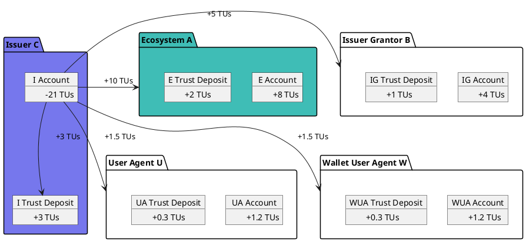
```plantuml

@startuml
scale max 1200 width
 

package "Ecosystem A" as tr #3fbdb6 {
    object "E Account" as tra {
         \t+8 TUs
    }
    object "E Trust Deposit" as trtd {
         \t+2 TUs
    }
}

package "Issuer Grantor B" as ig {
    object "IG Account" as iga {
        \t+4 TUs
    }
    object "IG Trust Deposit" as igtd {
        \t+1 TUs
    }
}
package "Issuer C" as issuer #7677ed {
    object "I Account" as issuera {
         \t-21 TUs
    }
    object "I Trust Deposit" as issuertd {
         \t+3 TUs
    }

}

package "User Agent U" as ua {
    object "UA Account" as uaa {
         \t+1.2 TUs
    }
    object "UA Trust Deposit" as uatd {
        \t+0.3 TUs
    }

}
package "Wallet User Agent W" as wua {
    object "WUA Account" as wuaa {
         \t+1.2 TUs
    }
    object "WUA Trust Deposit" as wuatd {
        \t+0.3 TUs
    }

}


issuera -r-> tr: \t+10 TUs

issuera -r-> ig: \t+5 TUs

issuera -d-> ua: \t+1.5 TUs

issuera -d-> wua: \t+1.5 TUs

issuera --> issuertd:  \t+3 TUs

@enduml

```

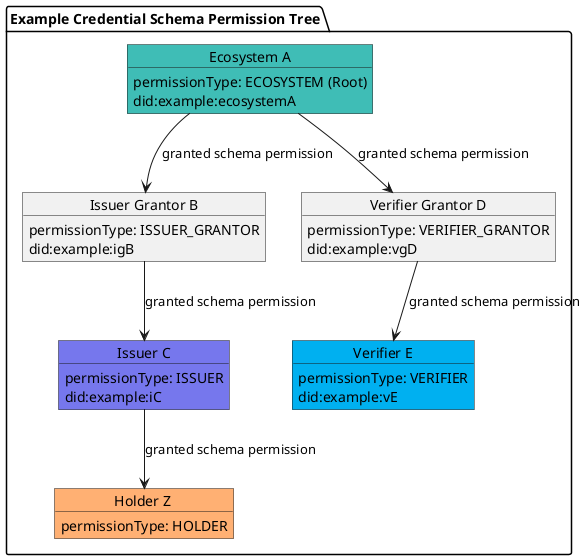
```plantuml

@startuml
scale max 800 width
 
package "Example Credential Schema Permission Tree" as cs {

    object "Ecosystem A" as tr #3fbdb6 {
        permissionType: ECOSYSTEM (Root)
        did:example:ecosystemA
    }
    object "Issuer Grantor B" as ig {
        permissionType: ISSUER_GRANTOR
        did:example:igB
    }
    object "Issuer C" as issuer #7677ed  {
        permissionType: ISSUER
        did:example:iC
    }
    object "Verifier Grantor D" as vg {
        permissionType: VERIFIER_GRANTOR
        did:example:vgD
    }
    object "Verifier E" as verifier #00b0f0 {
        permissionType: VERIFIER
        did:example:vE
    }

    object "Holder Z " as holder #FFB073 {
        permissionType: HOLDER
    }
}


tr --> ig : granted schema permission
ig --> issuer : granted schema permission

tr --> vg : granted schema permission
vg --> verifier : granted schema permission

issuer --> holder: granted schema permission

@enduml

```

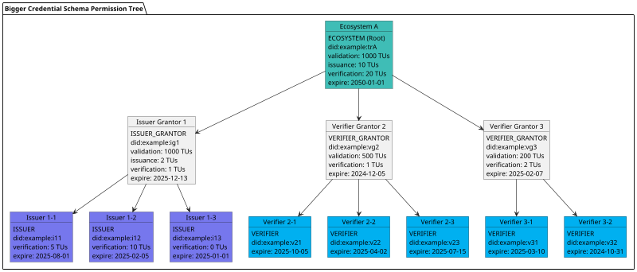
```plantuml

@startuml
scale max 800 width
 
package "Bigger Credential Schema Permission Tree" as cs {

    object "Ecosystem A" as tr #3fbdb6 {
        ECOSYSTEM (Root)
        did:example:trA
        validation: 1000 TUs
        issuance: 10 TUs
        verification: 20 TUs
        expire: 2050-01-01
    }
    

    object "Issuer Grantor 1" as ig1 {
        ISSUER_GRANTOR
        did:example:ig1
        validation: 1000 TUs
        issuance: 2 TUs
        verification: 1 TUs
        expire: 2025-12-13
    }
    
    
    
    object "Issuer 1-1" as i11 #7677ed  {
        ISSUER
        did:example:i11
        verification: 5 TUs
        expire: 2025-08-01
    }
    object "Issuer 1-2" as i12 #7677ed  {
        ISSUER
        did:example:i12
        verification: 10 TUs
        expire: 2025-02-05
    }
    object "Issuer 1-3" as i13 #7677ed  {
        ISSUER
        did:example:i13
        verification: 0 TUs
        expire: 2025-01-01
    }

    

    object "Verifier Grantor 2" as vg2 {
        VERIFIER_GRANTOR
        did:example:vg2
        validation: 500 TUs
        verification: 1 TUs
        expire: 2024-12-05
    }

    object "Verifier 2-1" as v21 #00b0f0  {
        VERIFIER
        did:example:v21
        expire: 2025-10-05
    }
    object "Verifier 2-2" as v22 #00b0f0  {
        VERIFIER
        did:example:v22
        expire: 2025-04-02
    }
    object "Verifier 2-3" as v23 #00b0f0  {
        VERIFIER
        did:example:v23
        expire: 2025-07-15
    }

    object "Verifier Grantor 3" as vg3 {
        VERIFIER_GRANTOR
        did:example:vg3
        validation: 200 TUs
        verification: 2 TUs
        expire: 2025-02-07
    }

    object "Verifier 3-1" as v31 #00b0f0 {
        VERIFIER
        did:example:v31
        expire: 2025-03-10
    }
    object "Verifier 3-2" as v32 #00b0f0 {
        VERIFIER
        did:example:v32
        expire: 2024-10-31
    }
    
}


tr --> ig1 
tr --> vg2
tr --> vg3

ig1 --> i11
ig1 --> i12
ig1 --> i13

vg2 --> v21
vg2 --> v22
vg2 --> v23

vg3 --> v31
vg3 --> v32


@enduml

```

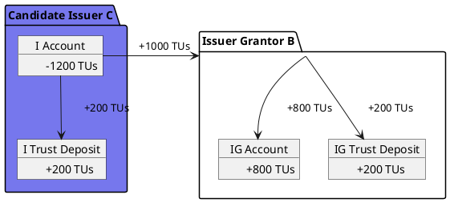
```plantuml

@startuml
scale max 1200 width
 


package "Issuer Grantor B" as ig {
    object "IG Account" as iga {
        \t+800 TUs
    }
    object "IG Trust Deposit" as igtd {
        \t+200 TUs
    }
}
package "Candidate Issuer C" as issuer #7677ed {
    object "I Account" as issuera {
         \t-1200 TUs
    }
    object "I Trust Deposit" as issuertd {
         \t+200 TUs
    }

}


issuera -r-> ig: \t+1000 TUs \t\t\t\t\t
issuera --> issuertd:  \t+200 TUs
ig --> iga: \t+800 TUs
ig --> igtd: \t+200 TUs

@enduml

```

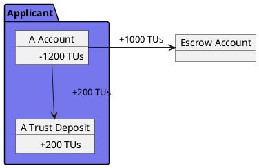
```plantuml

@startuml
scale max 1200 width
 


package "Applicant" as issuer #7677ed {
    object "A Account" as issuera {
         \t-1200 TUs
    }
    object "A Trust Deposit" as issuertd {
         \t+200 TUs
    }

}

object "Escrow Account" as escrow

issuera -r-> escrow: \t+1000 TUs
issuera --> issuertd:  \t+200 TUs


@enduml

```

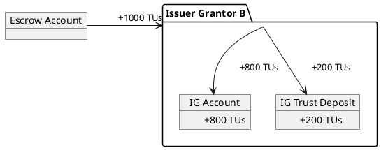
```plantuml

@startuml
scale max 1200 width
 


package "Issuer Grantor B" as ig {
    object "IG Account" as iga {
        \t+800 TUs
    }
    object "IG Trust Deposit" as igtd {
        \t+200 TUs
    }
}
object "Escrow Account" as escrow


escrow -r-> ig: \t+1000 TUs \t\t\t\t\t
ig --> iga: \t+800 TUs
ig --> igtd: \t+200 TUs

@enduml

```

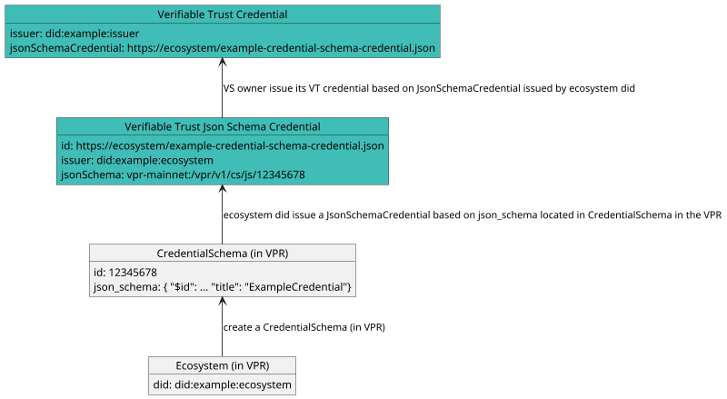
```plantuml

@startuml
scale max 800 width
object "Ecosystem (in VPR)" as es {
  did: did:example:ecosystem
}
object "CredentialSchema (in VPR)" as cs {
  id: 12345678
  json_schema: { "$id": ... "title": "ExampleCredential"}
}
object "Verifiable Trust Json Schema Credential" as jsc #3fbdb6 {
  id: https://ecosystem/example-credential-schema-credential.json
  issuer: did:example:ecosystem
  jsonSchema: vpr-mainnet:/vpr/v1/cs/js/12345678
}

object "Verifiable Trust Credential" as vscred #3fbdb6 {
  issuer: did:example:issuer
  jsonSchemaCredential: https://ecosystem/example-credential-schema-credential.json
}

cs <-- es : create a CredentialSchema (in VPR)
jsc <-- cs : ecosystem did issue a JsonSchemaCredential based on json_schema located in CredentialSchema in the VPR
vscred <-- jsc: VS owner issue its VT credential based on JsonSchemaCredential issued by ecosystem did

@enduml

```

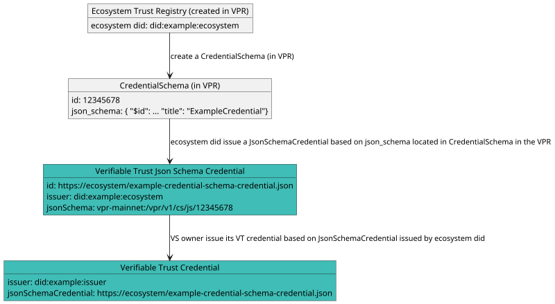
```plantuml

@startuml
scale max 800 width
object "Ecosystem Trust Registry (created in VPR)" as es {
  ecosystem did: did:example:ecosystem
}
object "CredentialSchema (in VPR)" as cs {
  id: 12345678
  json_schema: { "$id": ... "title": "ExampleCredential"}
}
object "Verifiable Trust Json Schema Credential" as jsc #3fbdb6 {
  id: https://ecosystem/example-credential-schema-credential.json
  issuer: did:example:ecosystem
  jsonSchema: vpr-mainnet:/vpr/v1/cs/js/12345678
}

object "Verifiable Trust Credential" as vscred #3fbdb6 {
  issuer: did:example:issuer
  jsonSchemaCredential: https://ecosystem/example-credential-schema-credential.json
}

 jsc --> vscred: VS owner issue its VT credential based on JsonSchemaCredential issued by ecosystem did
cs --> jsc : ecosystem did issue a JsonSchemaCredential based on json_schema located in CredentialSchema in the VPR
es --> cs : create a CredentialSchema (in VPR)

@enduml

```