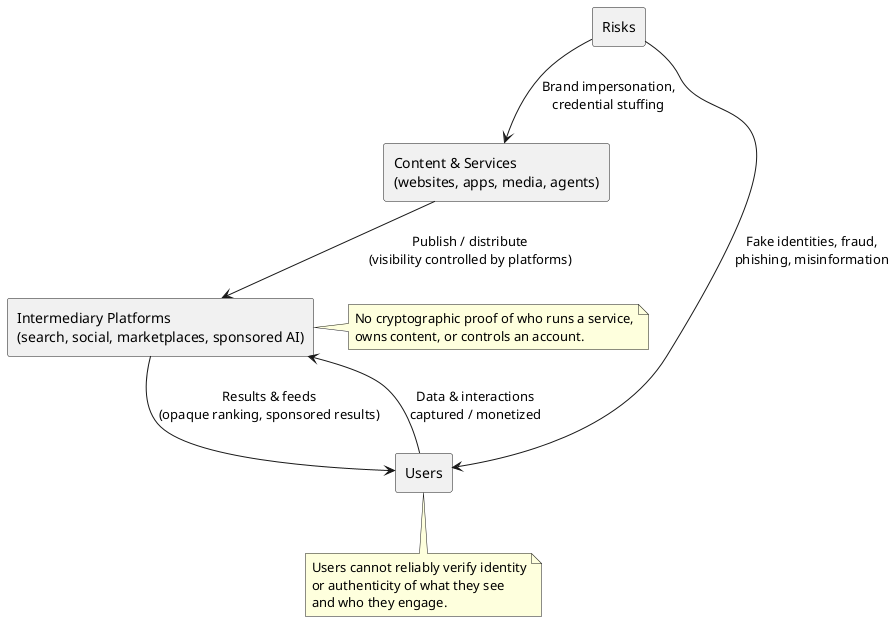
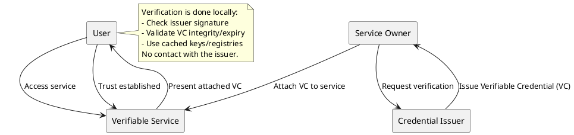
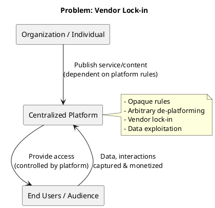
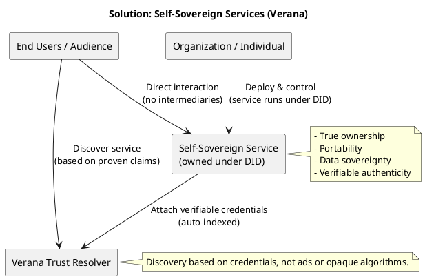
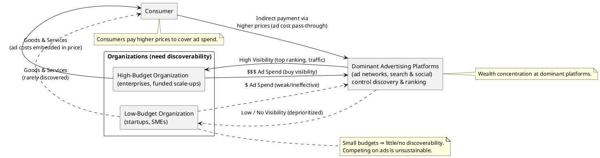
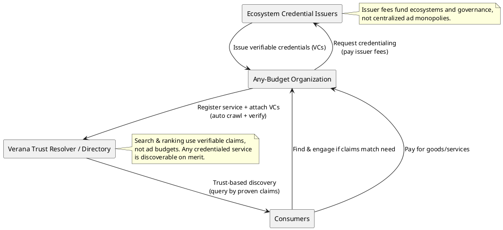

# Verana

**Verana**: a Verifiable Trust layer for the Internet

> Verana solves three systemic problems holding back the Internet today: trust, ownership, and discovery. These are the pillars of our value proposition. The exact pitch may evolve, but this is the framework guiding how we think about the market opportunity.

## 1. Making the Internet trustworthy

### 1.1 Problem

Today, the internet still lacks a native verifiable trust layer.
Content, services, and users interact without cryptographic guarantees of who they are or what they represent. This fuels misinformation, fraud, opaque intermediaries, and a general erosion of trust online.

### 1.2 Solution

Verana introduces a public, permissionless trust infrastructure that generalizes the use of verifiable credentials. Any ecosystem - governments, industries, communities... - can use Verana to build sovereign trust networks. Within these networks, participants can issue, verify, and obtain credentials that certify claims of identity, authenticity, or authorization.

Credential holders can attach these proofs to their digital assets, services, and channels, demonstrating ownership, provenance, or qualifications.

This creates a Verifiable Identity Layer for the Internet, turning the web into an environment where trust is transparent, interoperable, and verifiable.

Examples of what becomes verifiable with Verana:

- **Digital Services**: A service can prove who is its owner.
- **Individual Claims**: As an Individual, I can prove anything online (identity, membership, diploma,...).
- **User Agents**: When I connect to a digital service with my user agent, services can verify what is the software I am using.
- **Content Provenance**: Anyone can verify a signed content and gather who is its publisher.
- **Smart Contracts**: As an Organization I can prove I control a Smart contract.
- **RWA Token Ownership**: As an individual, I can prove y own a RWA token.

## 2. Service Ownership: Migrating from Vendor Lock-in to Self Sovereign Services

### 2.1 Problem

Today’s digital services are built on centralized platforms that act as gatekeepers. Whether it’s a social network, an app store, or a SaaS provider, organizations and individuals rarely own their services or their audiences:

- Content and connections are rented, not owned.
- Platforms enforce opaque rules and can de-platform users arbitrarily.
- Migrating services between providers is costly and disruptive.
- User data is captured, mined, and monetized by intermediaries.

The result: vendor lock-in, loss of sovereignty, and a fragile dependency on centralized operators.

### 2.2 Solution

Verana enables organizations and individuals to deploy Self-Sovereign Services—digital services they fully own and control. Built on verifiable credentials and decentralized trust registries, these services are portable, provable, and free from platform lock-in.

Key properties:

- True Ownership: services run under your decentralized identifier (DID), not under a platform account.
- Data Sovereignty: you retain full control over your data, audience, and connections.
- Portability: migrate freely between cloud, self-hosted, or hybrid environments without losing trust or discoverability.
- Verifiable Authenticity: cryptographically prove the legitimacy of your service to users and partners.
- Trust-Based Discovery: services are discoverable via Verana’s resolver, ranked by credentials—not ad budgets or opaque algorithms.

Examples of Self-Sovereign Services:

- Decentralized social channels owned entirely by creators.
- Agentic AI and IoT services operating under verifiable credentials.
- Content delivery channels (e.g., media catalogs) with guaranteed provenance.
- Customer support or business chatbots that are verifiable and portable.

This migration replaces dependency on centralized vendors with autonomous, verifiable ownership, turning digital services into assets you control, not permissions you rent.

## 3. Service Discovery: Re-distribution of Wealth

### 3.1 Problem

Today, consumer discoverability of goods and services is controlled by centralized platforms that rely on advertising, opaque SEO algorithms, and now even sponsored AI results.

- Wealth is concentrated in a handful of dominant companies.
- Innovation suffers, as startups and SMEs cannot compete with massive advertising budgets.
- These intermediaries capture a disproportionate share of value, forcing consumers to pay higher prices for goods and services.

### 3.2 Solution

Verana replaces this extractive model with an open, decentralized, and verifiable trust system powered by verifiable credentials:

- Ecosystems establish decentralized trust networks, each specializing in certifying specific claims within defined jurisdictions.
- Individuals and organizations join the ecosystems they care about, collecting verifiable credentials that can be attached to their digital channels.
- Automatic indexing ensures these credentials are crawled, verified, and included in a global directory of verifiable data.
- Discoverability becomes instant and transparent: services are surfaced based on what their credentials prove, not on who paid for ads.

This marks a shift away from centralized control by a few corporations toward a federated economy of thousands of ecosystems, each competing on trust, authenticity, and the quality of their certifications.

